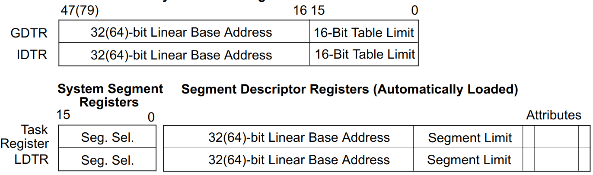

# 第一次读书笔记——x86 系统架构综述

## 系统级体系结构概览
### GDT和LDT
GDT和LDT是全局描述符表和本地描述符表的简称， 表项称为段描述符的条目。
段描述符提供段的基址以及访问权限、类型和使用信息。
是保护模式下，进行内存访问的必要寄存器。

每个段描述符都有一个相关联的段选择子,
段选择子为使用它的软件提供了到GDT或LDT的索引。
一个全局/局部标志(决定选择子是指向GDT还是LDT)，以及访问权限信息。

要访问段中的字节，必须提供段选择子和偏移量。
段选择子提供了对段描述符的访问。
处理器从段描述符中，获取线性地址空间(类似虚拟地址)基址，偏移量由指令提供。
这种机制可以用于访问任何有效的代码、数据或堆栈段，只要这些段可以从处理器运行的当前特权级别(CPL)访问。
CPL定义为当前正在执行的代码段的保护级别，0表示内核模式，权限最高，3表示用户模式，权限最低。

### 系统段，段描述符和门
任务状态段(task-state segment, TSS)和LDT。是架构定义的两个系统段。
专门用于进行任务切换，以及切换时的权限检查。
GDT不被认为是段，因为它不是通过段选择器和段描述符访问的。
但是TSS和LDT有为它们定义的段描述符，位于GDT中。
门是四种特殊的段描述符，分别是调用门、中断门、自陷门和任务门
会在执行跳转指令的时候检查权限,如果检查失败,会切换栈段至相应的特权级别

### 任务状态段和任务门
任务状态段和任务门定义了任务执行环境的状态，用于进行任务切换。
包括各种寄存器、段选择器、三个堆栈段的堆栈指针，每个特权级别对应一个堆栈和
LDT的段选择子、分页结构层次结构的基址。

当前任务的TSS的段选择器存储在任务寄存器中。
切换到任务的最简单方法是调用或跳转到新任务。
这里，新任务的TSS的段选择器在CALL或JMP指令中给出。
在切换任务时，处理器执行以下操作:
1. 在当前TSS中存储当前任务的状态。
2. 用新任务的段选择器加载任务寄存器。
3. 通过GDT中的段描述符访问新的TSS。
4. 将新任务的状态从新的TSS加载到各种寄存器、LDTR、CR3。
5. 开始执行新任务。

### 中断和异常处理
硬中断、软中断和异常都是通过中断描述符表，即IDT处理的。
IDT存储一组门描述符，这些描述符提供对中断和异常处理程序的访问。
与GDT一样，IDT也不是一个段。IDT的线性地址包含在IDT寄存器(IDTR)中。
为了访问中断或异常处理程序，处理器首先通过中断或异常指令从内部硬件、外部中断控制器或软件接收中断向量。
中断向量提供IDT的索引。 如果选择的门描述符是中断门或陷阱门，则以类似于通过调用门调用过程的方式访问相关的处理程序过程。
如果描述符是一个任务门，则通过任务切换访问处理程序。

### 内存管理
x86支持的直接物理寻址或分页的虚拟内存。
当使用物理寻址时，线性地址被视为物理地址。
当使用分页时，可以对所有代码、数据、堆栈和系统段进行分页，只有最近访问的页面保存在物理内存中。
页在物理内存中的位置包含在分页结构中， 这些结构驻留在物理内存中。
页表层次结构的物理基地址在CR3中。
分页结构中的条目确定页的物理基址、访问权限和内存管理信息。
为了使用这种分页机制，线性地址被分解成几个部分。
这些部分为分页结构和页帧提供单独的偏移量。
一个系统可以有一个或多个分页结构的层次结构。
例如，每个任务可以有自己的层次结构。

### 系统寄存器
* EFLAGS寄存器中的系统标志和IOPL字段控制任务和模式切换，中断处理，指令跟踪和访问权限。
* 控制寄存器(CR0, CR2, CR3和CR4)包含各种用于控制系统级操作的标志和数据字段
* 调试寄存器允许在调试程序和系统软件中设置断点，不重要
* GDTR、LDTR和IDTR寄存器包含各自表的线性地址和条目个数
* 任务寄存器包含当前任务的TSS的线性地址和大小。

## 实模式和保护模式转换
IA-32支持三种工作模式——实模式、保护模式、系统管理模式，和一种准工作模式——虚拟x86模式 
1. **实模式**，提供了英特尔8086处理器的编程环境，并提供了模式切换的功能扩展
2. **保护模式**，是处理器的本机工作模式。它提供了一组丰富的体系结构特性、灵活性、高性能以及对现有软件库的向后兼容性
3. **实模式和保护模式转换**：处理器在复位后置于实模式，然后控制寄存器CR0中的PE标志写1则切换保护模式
4. 系统管理模式，从Intel386SL开始的，所有IA-32CPU的标准架构特性。通过中断控制开启，不是重点
5. 虚拟x86模式, 是在保护模式下的准工作模式，这种模式允许处理器在受保护的多任务环境中执行8086软件

## 80x86系统指令寄存器
### 标志寄存器
EFLAGS 带有许多用于系统的标志位，在此只列出几个重要的
1. **Trap**：置起为启用单步调试模式，清除以禁用单步模式。
在单步模式下，处理器在每条指令之后生成一个调试异常。
这允许在每条指令之后检查程序的执行状态。如果应用程序通过POPF、POPFD、IRET指令设置TF标志，
则后一条指令在完成执行后会产生一个自陷异常。
2. **IF**：用于控制处理器对可屏蔽硬件中断请求的响应。
该标志置起则响应可屏蔽的硬件中断，否则不响应可屏蔽的硬件中断。
IF标志不影响异常或不可屏蔽中断(NMI中断)的生成。
CPL、IOPL和控制寄存器CR4中的VME标志的状态决定了IF是否可以被CLI、STI、POPF、POPFD和IRET指令修改。
3. **IOCP**：表示当前运行的程序或任务的I/O特权级别。
当前运行的程序或任务的CPL必须小于等于IOPL才能访问I/O地址空间。
POPF和IRET指令只有在CPL为0时才能修改该字段。
4. **Nested task**：控制中断任务和被调用任务的链接。
处理器在调用CALL指令、中断或异常启动的任务时设置此标志。
它检查并修改由IRET指令启动的任务的返回值。
该标志可以通过POPF/POPFD指令显式地设置或清除。
但是，更改此标志的状态可能会在应用程序中产生意外的异常。

### 内存管理寄存器，
四个重要的内存管理寄存器是GDTR，LDTR，IDTR，TR。
可以分为两类，GDTR和IDTR一类，IDTR和TR一类。
第一类只记录对应表项的物理基址、表项最大数目。如前文所述，它们不是段，只能存在一份。
第二类记录表项索引，表项里的物理基址、段长度、属性等,
第二类专门用于任务切换，在进行任务切换的时候会自动加载，但不会自动保存。

### 控制寄存器
1. **CR0** 包含控制处理器运行模式和状态的系统控制标志。
2. CR1 保留。
3. **CR2** 包含页面错误线性地址，导致页面错误的线性地址，类似mips中协处理器0的badaddr。
4. **CR3** 包含分页结构层次结构的基础物理地址和两个标志(PCD和PWT)。
只指定基址的最高有效位，地址的下12位被假定为0。
因此，第一个分页结构必须与页(4-KByte)边界对齐。
PCD和PWT标志控制处理器内部数据缓存中分页结构的缓存。

## 系统指令
1. **LGDT、SGDT**：加载和存储GDTR
2. **LIDT、SIDT**：加载和存储IDTR
2. **LLDT、SLDT**：加载和存储IDTR
2. **LTR、STR**：加载和存储TR
