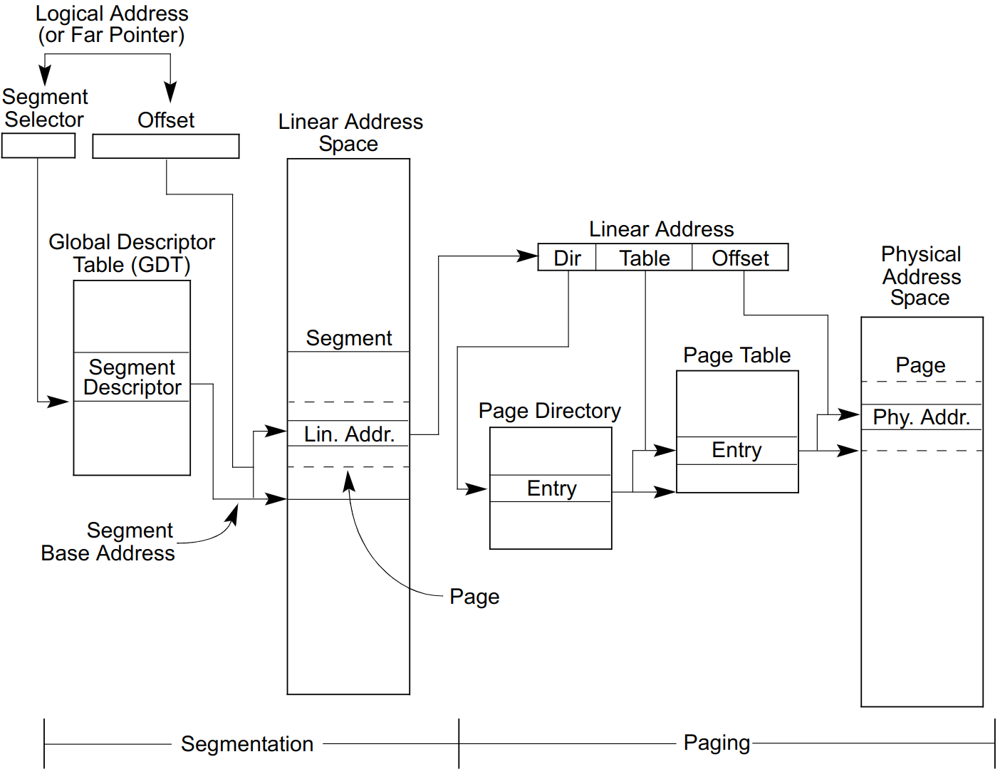
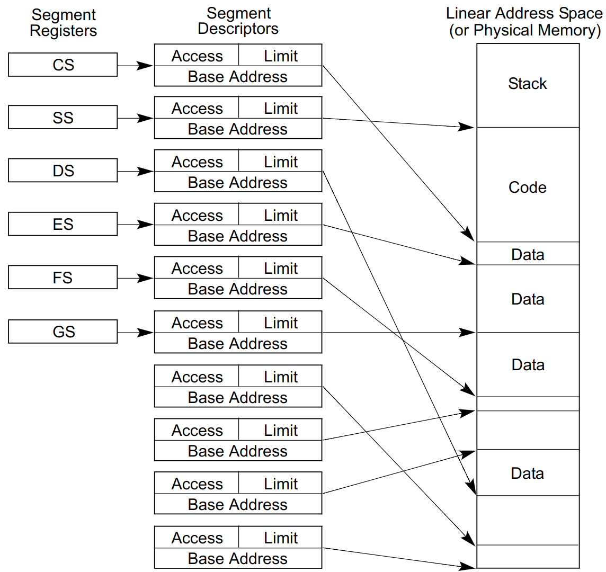
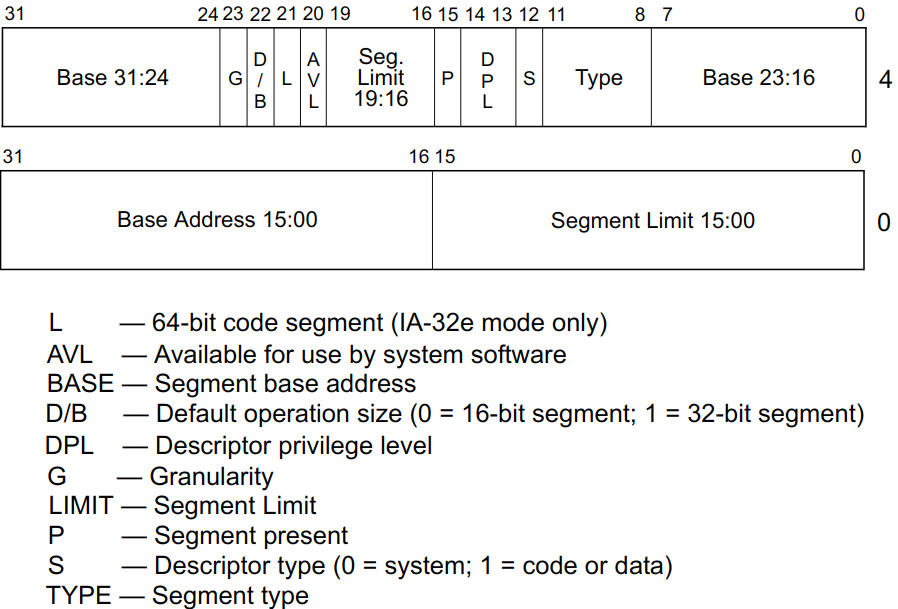
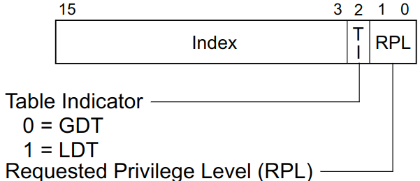

# 第二次读书笔记——保护模式内存管理

## 内存管理概览
在理解三个地址概念之前，首先需要了解**线性地址空间**和**段**的概念，
+ **线性地址空间**：CPU能表示的所以地址空间。RISC中对应的概念是**虚地址空间**
+ **段**：将线性地址空间分成**小块的**，**受保护的**空间。RISC中<u>不存在</u>对应的概念。

三种地址的概念和转换如下图所示：
+ 逻辑地址(Logical Address)：段选择子(16bits):偏移量(32bits)， 段选择子是段的唯一标识符，还提供了描述符表到描述符的索引。
每个段都有一个段描述符，指定段的大小、访问权限和特权级别、读写执行类型以及段的基址。
+ 线性地址(Linear Address)：段基址+偏移量，即RISC中的虚地址
+ 物理地址(Physical Address)：经页表转换的地址，即实际存在的内存，而非CPU能区分的地址空间。
如果不开启分页功能，线性地址即物理地址。

## 分段机制
* Basic Flat Model：程序可以可以访问连续的、未分段的地址空间，相当于没有分段机制。
要使用IA-32架构实现基本的扁平内存模型，必须至少创建两个段描述符，一个用于引用代码段，另一个用于引用数据段。
但两个段描述符具有相同的基址值0、相同的上限4GB。即是访问了不存在的物理地址，分段机制就不会因为超出内存引用的限制而产生异常。
* Protected Flat Model：保护平面模型在基本平面模型的基础上，增加了只能引用内存地址范围的限制。
任何超出范围内存访问会导致一个通用保护异常(#GP)。此模型提供了针对某些类型的程序错误的最低级别硬件保护。
可以为这个受保护的平面模型添加更多的复杂性，以提供更多的保护。
* Multi-Segment Model：在保护平面模型的基础上提供了，共享和私有的检查，特权级别的检查、读写执行的检查。
一般会定义多个段描述符，而不是上面两种模式的少数个，如下图所示：

分段机制与分页机制是独立的，分页机制可以在任何上述模型中使用。
分页机制也可以提供逐页的特权级别的检查、读写执行的检查。

## 逻辑地址和线性地址的转换

* **段描述符 Segment Descriptors**：GDT或LDT中的数据结构，它向处理器提供段的大小和位置，以及访问控制和状态信息。
段描述符通常由编译器、链接器、加载器或操作系统或执行器创建，而不是由应用程序创建。
下图说明了所有类型段描述符的通用描述符格式。

这里挑选几个重要的位域进行说明：
    * Base address：段的线性基地址，建议16bits对齐
    * Segment limit：表示段范围限制，具体范围大小需结合G域，具体扩展方向，结合type域。
    * G：粒度，当粒度标志为0时，Segment limit以byte单位解释； 否则，以4-KByte单位解释。
    * S：表示是系统段(LDT、SST、门描述符等)还是通常段(代码段、数据段、栈段)，具体需结合type域
    * Type：指示段的属性，一共四位。指示段的类型，读写权限，执行权限等。
    * DPL：段的特权级别，DPL用于控制对段的访问。

    GDT的第一个条目不被处理器使用。被用作“空段选择子”。当段寄存器加载空选择器时，CPU不会产生异常。
    但空选择器的段寄存器被用来访问内存时，它会生成一个异常。
    段选择器作为架构状态的一部分，对应用程序可见。
    但选择器的值通常由链接编辑器或链接加载器分配或修改，而不是由应用程序分配或修改。

* 段选择子 Segment Selectors：一个16位的段的唯一标识符，如下图所示。它不直接指向这个段，而是指向定义这个段的段描述符。
段选择器包含如下三部分：
    * INDEX：GDT或LDT的索引,至多8192个，每个8bytes
    * TI：表示在GDT还是LDT中
    * RPL：请求特权级，指定了选择子的特权级

* 段寄存器 Segment Registers：**存储段选择子**和**缓存段描述符**的寄存器。
IA-32架构下共有6个，其中最重要的三个是CS、SS、DS，分别存储代码段，栈段，数据段。
加载段寄存器有两个方法
    1. 使用指令MOV, POP, LDS, LES, LSS, LGS和LFS，这些指令显式引用段寄存器。
    2. 隐含的加载，如CALL、JMP和RET指令的远指针版本，SYSENTER和SYSEXIT指令，以及IRET、INTn、INTO和INT3指令。
    这些指令改变CS寄存器的内容，作为其操作的附带部分。

* 逻辑地址与线性地址的转换
    1. 使用段选择器中的偏移量来定位GDT或LDT中段的段描述符，并将其读入处理器。(只有当一个新的段选择器被加载到一个段寄存器中时，才需要这一步。)
    2. 检查段描述符，以检查段的访问权限和范围，以确保段是可访问的，并且偏移量在段的限制之内。
    3. 将段描述符中的段的基址添加到偏移量中以形成线性地址。

## 描述符的分类
* 数据段描述符 Data segment Descriptor：描述符S域为1，且type最高位为0，可以对读、写、扩展方向做不同限制。
* 代码段描述符 Code segment Descriptor：描述符S域为1，且type最高位为1，可以对读、执行、特权检查做不同限制。
* 局部描述符表描述符 Local descriptor-table (LDT) segment descriptor：描述符S域为0，且type为0b0010，指向一个LDT
* 任务状态段描述符 Task-state segment (TSS) descriptor：描述符S域为0，且type为0bx010，可以是16-bits和32-bits的
* 调用门描述符 Call-gate descriptor：描述符S域为0，且type为0bx100，可以是16-bits和32-bits的
* 中断门描述符 Interrupt-gate descriptor：描述符S域为0，且type为0bx110，可以是16-bits和32-bits的
* 陷阱门描述符 Trap-gate descriptor：描述符S域为0，且type为0bx111，可以是16-bits和32-bits的
* 任务门描述符 Task-gate descriptor：描述符S域为0，且type为0b0101，可以是16-bits和32-bits的
